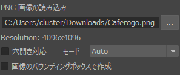
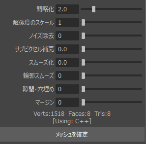
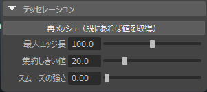

# 機能・使い方

## 基本的な使い方

1. **ツールの起動**: シェルフまたはスクリプトエディタからツールを起動します。
2. **画像選択**: `PNG 画像の読み込み` の横の `...` ボタンをクリックし、メッシュ化したいPNG画像を選択します。
3. **パラメータ調整**: 必要に応じて、解像度や簡略化などの設定を調整します（詳細は後述）。
4. **生成**: **「メッシュを確定」** ボタンをクリックすると、Maya上にメッシュが確定（実体化）されます。
   - ※ プレビュー中は `PreviewMesh` グループ内に一時的なメッシュが生成されます。

## UI項目の説明

### 基本設定 (Core Settings)

- **PNG画像の読み込み**: 入力するPNGファイルのパスです。フォルダアイコンから選択できます。
- **Resolution**: 現在読み込んでいる画像の解像度が表示されます。
- **穴開き対応**: チェックを入れると、画像内の透明な「穴」も考慮してメッシュを生成します。
- **モード**: 処理エンジンを選択します。
  - **Auto**: 推奨設定です。適宜最適なエンジンを選択します。
  - **C++**: 高速なコアです。
  - **Python**: 高度なフィルタ設定を使用する場合に自動的に切り替わります。
- **画像のバウンディングボックスで作成**: 画像全体を囲むシンプルな矩形メッシュを作成します。

### 詳細設定 (Advanced Settings)

- **簡略化**: 輪郭の近似精度です。小さいほど高精度ですが、ポリゴン数が増えます。
- **解像度のスケール**: 画像の読み込み解像度を倍数で指定します。メッシュの密度に影響します。
- **ノイズ除去**: 画像内の細かなゴミを除去します。
- **サブピクセル補完**: ピクセル間の補間を行い、より滑らかな輪郭を抽出します。
- **スムーズ化**: 輪郭全体を滑らかにぼかしたような形状にします。
- **輪郭スムーズ**: 抽出後の頂点座標に対して平滑化を行います。
- **隙間・穴埋め**: 形状の細かな隙間や穴を埋めて一体化させます。
- **マージン**: 輪郭から指定したピクセル分だけ外側へ拡張します。
- **Verts / Faces / Tris**: 現在プレビューされているメッシュの統計情報です。
- **[Using : Python / C++]**: 現在どちらのエンジンで計算されているかが表示されます。
- **メッシュを確定**: 現在のプレビュー状態のメッシュを本番用としてシーンに確定（親子関係の解除とリネーム）します。

### テッセレーション

メッシュのトポロジを整理するための機能です（Mayaの `polyRemesh` を使用します）。

- **再メッシュ（既にあれば値を取得）**: 選択したメッシュに対して再メッシュ処理を実行、または設定値を取得します。
- **最大エッジ長**: 三角形の最大サイズを指定します。
- **集約しきい値**: 近い頂点をどれだけ統合するかを指定します。
- **スムーズの強さ**: 表面を滑らかにする強さを指定します。

## その他

- **Maya 2024 推奨**: Maya 2024での動作を確認しています。2025以降ではPythonのバージョン差異により動作しない可能性があります。
- **単位について**: 本ツールはメートル(m)単位での運用を想定したスケーリングを行います。
